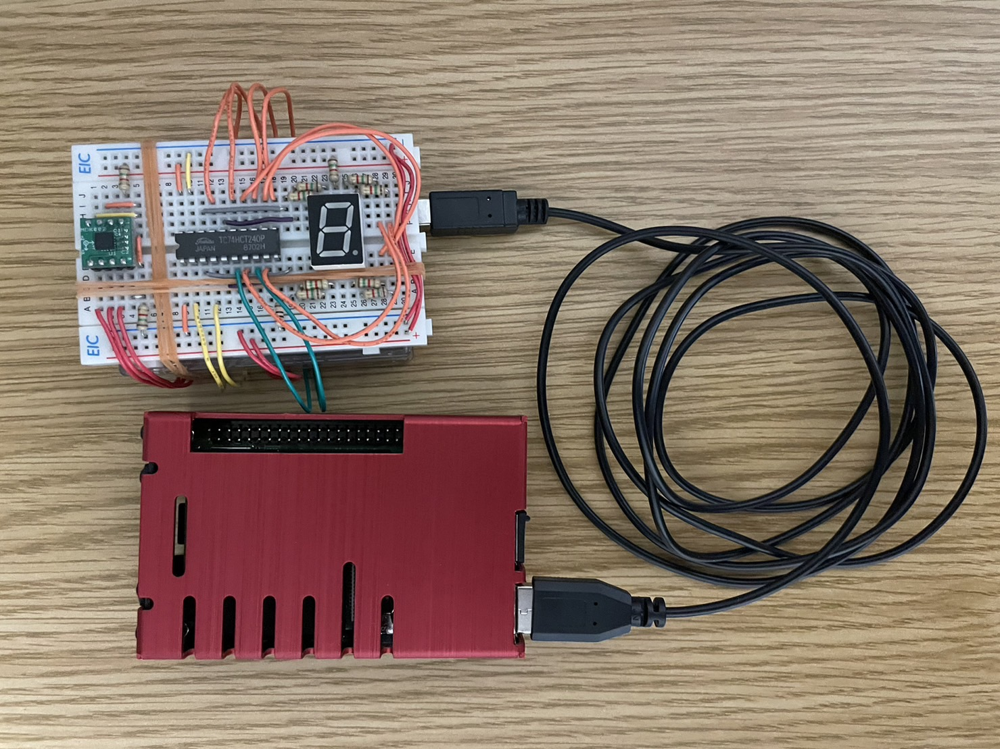
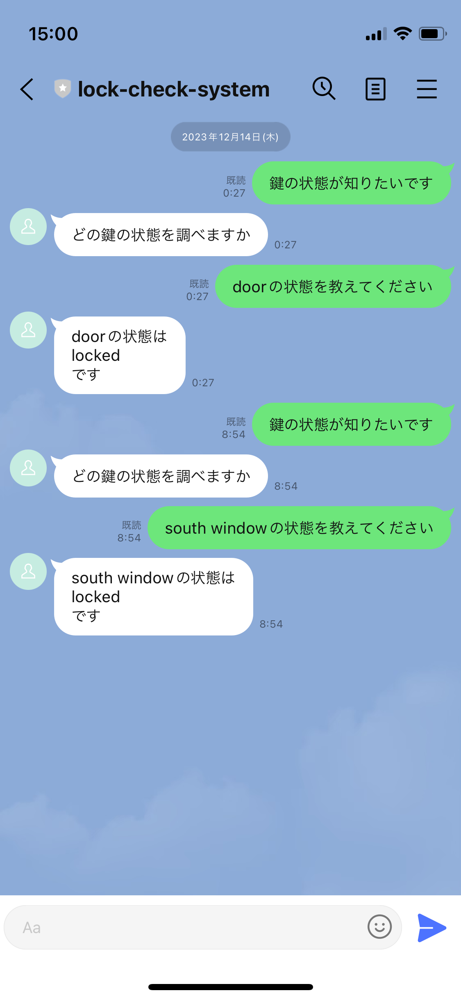
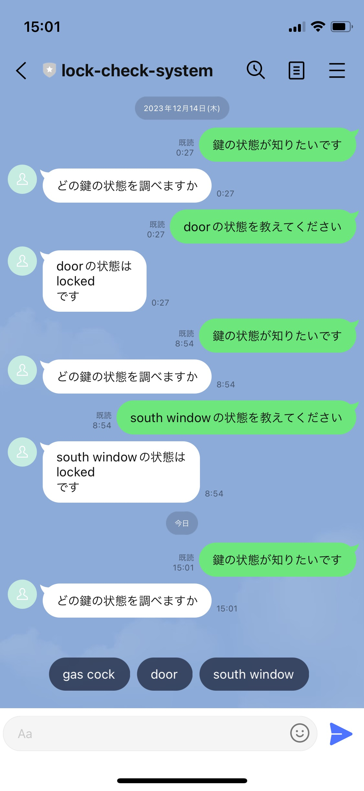

# Lock-Check-System
家庭内に存在する様々なモノの施錠状況を確認するプログラムです．
Arduino Unoや加速度センサなどの機器を使用することを前提として設計・作成しています．．

**本プログラムを用いて行う一切の行為，被った損害・損失に対しては，一切の責任を負いかねます**

## ディレクトリ構成
```
.
├── azure_functions
│   ├── .vscode (省略)
│   ├── .functionignore
│   ├── .gitignore
│   ├── host.json
│   ├── requirements.txt
│   └── app
│       ├── app.dat
│       ├── app.py
│       └── function.json
├── IoT-Device
│   ├── .gitignore
│   ├── IoT-Device.ino
│   ├── IoT-Device.py
│   └── requirements.txt
├── .fig (省略)
├── .gitignore
└── README.md
```

## 構成と設計

### IoTデバイス側の構成
- USBケーブル Type A-B
- Arduino Uno R3
- Raspberry Pi 4B (4GB)
    - Raspberry Pi OS (server)
    - Python 3.10.2
- ADXL335
- 1.5kΩ抵抗
- ジャンパワイヤ
- ブレッドボード（動作確認を行う場合）
    - KW1-1002ASB
    - TC74HCT240P（他社のロジックICインバータでも代用可）
    - 300Ω抵抗
#### 各種機器の結線・接続例（動作確認用の回路を含む）


#### 回路図（動作確認用の回路を含む）


##### 動作確認用の回路について
動作確認用の回路は，ある向きにブレッドボードを傾けた際に最下部にあるセグメントを点灯させる仕組みです．
また，z軸方向に加速度を検知した場合，ADXL335における正の方向ではセグメントD.Pが点灯し，負の方向ではセグメントGが点灯します．

なお，KW1-1002ASBはアノードコモンであるため，ロジックICインバータを経由することで[スケッチ](IoT-Device/IoT-Device.ino)のコード量を減らしています．

### サーバ側の構成
- Azure IoT Hub
- Azure Cosmos DB
- Azure Functions
    - Message API
### 全体の設計


#### 使用した画像・アイコンの引用元サイト一覧
- Microsoft Learn, Azure アーキテクチャ アイコン, https://learn.microsoft.com/ja-jp/azure/architecture/icons/, 2024/01/16 access
- LINE, LINE APP ICON GUIDELINE, https://line.me/ja/logo, 2024/01/16 access
- いらすとや, かわいいフリー素材集 いらすとや, https://www.irasutoya.com/, 2024/01/16 access

## ビルド
### Arduinoの操作
[スケッチ (IoT-Device.ino)](IoT-Device/IoT-Device.ino)の21行目にある"device_name"の記述をIoTデバイス名に合わせて変更してください（例えば，"door"や"south window"など）．
その後，Arduino IDEで[スケッチ](IoT-Device/IoT-Device.ino)の検証と書き込みを行ってください．
### Raspberry Pi
シリアルポート通信が可能となるように，Arduino UnoとRaspberry Piを接続してください．
[requirements.txt](IoT-Device/requirements.txt)から，[IoT-Device.py](IoT-Device/IoT-Device.py)の実行に必要なPythonパッケージをインストールしてください．
そして，以下の表に示す環境変数を設定してください．
|環境変数名|設定する内容|
|-|-|
|IOTHUB_DEVICE_NAME|Azure IoT HubのデバイスID|
|IOTHUB_DEVICE_CONNECTION_STRING|Azure IoT Hubのプライマリ接続文字列|
|COSMOS_DB_CONNECTION_STRING|Cosmos DBの接続文字列|
|COSMOS_DB_DATABASE_STRING|Cosmos DBのデータベースID|
|COSMOS_DB_CONTAINER_STRING|Cosmos DBのコンテナID|

### Azure IoT Hub
各IoTデバイスに対応するIoTハブを作成してください．
また，"ハブ設定＞メッセージ ルーティング"より，IoTデバイスから受け取ったメッセージがCosmos DBに転送されるようにエンドポイントとルートを設定してください．

### Azure Cosmos DB
APIをコア(SQL)，容量モードをServerlessに設定した
Azure Cosmos DBアカウントを作成してください．

### Azure Functions
以下の表に示す環境変数を作成した関数アプリに設定してください．
|環境変数名|設定する内容|
|-|-|
|LINE_CHANNEL_ACCESS_TOKEN|Message APIのアクセストークン|
|LINE_CHANNEL_SECRET|Message APIのチャンネルシークレット|
|COSMOS_DB_CONNECTION_STRING|Cosmos DBの接続文字列|
|COSMOS_DB_DATABASE_STRING|Cosmos DBのデータベースID|
|COSMOS_DB_CONTAINER_STRING|Cosmos DBのコンテナID|

#### 関数のデプロイにVScodeを使用する場合 (推奨)
VScodeの拡張機能である**Azure Functions**をインストールしてください．
その後，VScodeでazure_functionsディレクトリを開き，"Azure＞WORKSPACE＞Azure Functions＞Deploy to Function App..."から，関数のデプロイを実行してください．

### LINE Developers
まず，LINE Developersにてプロバイダとチャンネルを作成してください．
次に，Message APIのアクセストークンとチャンネルシークレットを発行してください．
関数アプリからチャンネルに接続する際に，これらのキーを使います．
そして，チャンネルの"Message API設定＞Webhook設定"に，関数アプリのURLの末尾に"/api/app"を追加したURLを記入し，Webhookの利用を有効にしてください．

## 実行

### 加速度データを送信するプログラムの起動 (Raspberry Pi)
以下の操作により，加速度に関するデータをAzure IoT Hubへ送信するプログラムを起動できます．
```
python3 IoT-Device.py
```

### LINEの操作
本アプリでは，Cosmos DBに登録されている施錠データをLINEのチャンネルから要求する場合，
2段階に分けてメッセージを送る必要があります．
1段階目では，LINEのチャンネルに"かぎ"，"カギ"，"鍵"のいずれかの語を含むメッセージを送信します．
例えば，"鍵の状態を教えてください"というメッセージを送信します．
送信後，アクセスするデータを決定するクイックリプライがLINEのメッセージに送信されます．
2段階目では，そのクイックリプライの中から，施錠状況を確認したい対象を選択します．
その後，それに対応する施錠状況のデータがLINEのチャンネルに送信されます．

ここで，Microsoft Azureを利用して施錠状況を確認するプログラムを操作する様子を示します．
なお，Cosmos DBには"door"，"gas cock"，"south window"の情報が登録されています．
"トーク画面の様子"より，施錠状況を確認したい対象に合わせて，
対応する情報がLINE のチャンネルに送信されていることを確認できます．
また，"施錠状況を確認する様子"より，施錠状況を確認したい対象に合わせて，
対応する情報がLINE のチャンネルに送信されていることを確認できます．

|トーク画面の様子|施錠状況を確認する様子|
|-|-|
|| |