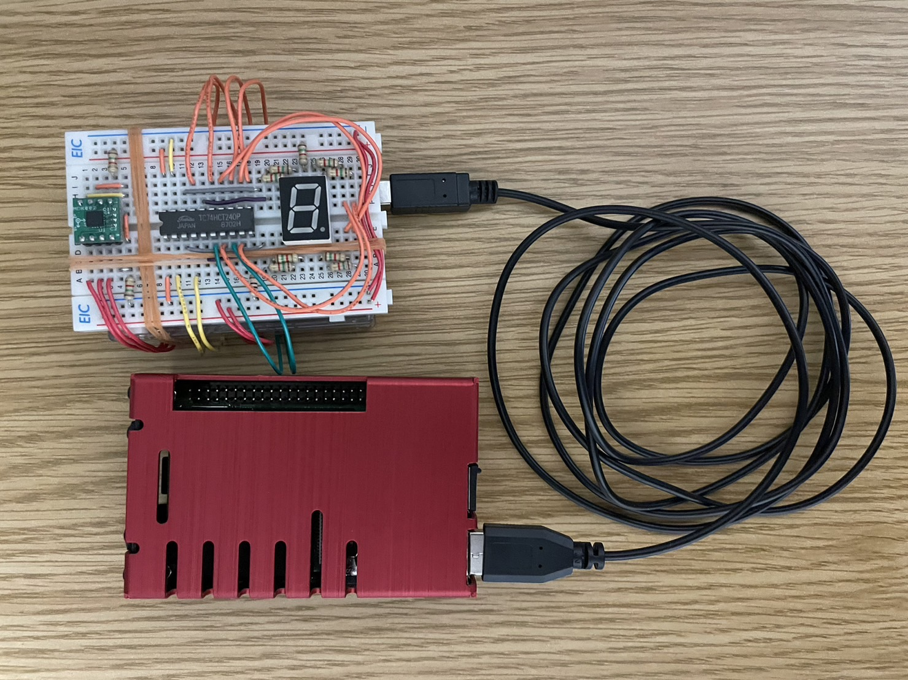
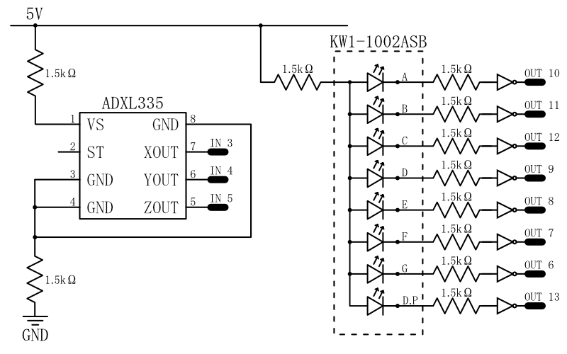
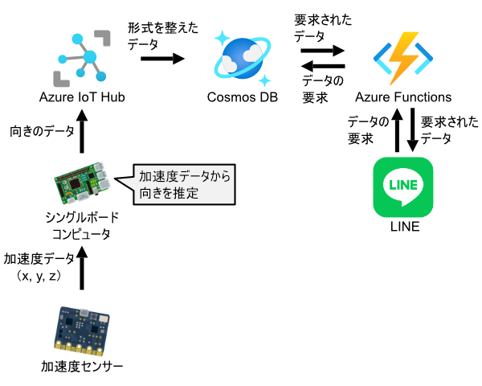

# Lock-Check-System
家庭内に存在する様々なモノの施錠状況を確認するプログラムです．
Arduino Unoや加速度センサなどの機器を使用することを前提として設計・作成しています．．

**本プログラムを用いて行う一切の行為，被った損害・損失に対しては，一切の責任を負いかねます**

## ディレクトリ構成
```
.
├── azure_functions
│   ├── .vscode (省略)
│   ├── .functionignore
│   ├── .gitignore
│   ├── host.json
│   ├── requirements.txt
│   └── app
│       ├── app.dat
│       ├── app.py
│       └── function.json
├── IoT-Device
│   ├── .gitignore
│   ├── IoT-Device.ino
│   ├── IoT-Device.py
│   └── requirements.txt
├── .fig (省略)
├── .gitignore
└── README.md
```

## 構成と設計

### IoTデバイス側の構成
- USBケーブル Type A-B
- Arduino Uno R3
- Raspberry Pi 4B (4GB)
    - Raspberry Pi OS (server)
    - Python 3.10.2
- ADXL335
- 1.5kΩ抵抗
- ジャンパワイヤ
- ブレッドボード（動作確認を行う場合）
    - KW1-1002ASB
    - TC74HCT240P（他社のロジックICインバータでも代用可）
    - 300Ω抵抗
#### 各種機器の結線・接続例（動作確認用の回路を含む）


#### 回路図（動作確認用の回路を含む）


### サーバ側の構成
- Azure IoT Hub
- Azure Cosmos DB
- Azure Functions
    - Message API
### 全体の設計


#### 使用した画像の引用元サイト一覧
- Microsoft Learn, Azure アーキテクチャ アイコン, https://learn.microsoft.com/ja-jp/azure/architecture/icons/, 2024/01/16 access
- LINE, LINE APP ICON GUIDELINE, https://line.me/ja/logo, 2024/01/16 access
- いらすとや, かわいいフリー素材集 いらすとや, https://www.irasutoya.com/, 2024/01/16 access

## ビルド
### Raspberry Pi
シリアルポート通信が可能となるように，Arduino UnoとRaspberry Piを接続してください．
#### 環境変数
以下の表に示す環境変数を設定してください．
|環境変数名|設定する内容|
|-|-|
|IOTHUB_DEVICE_NAME|Azure IoT HubのデバイスID|
|IOTHUB_DEVICE_CONNECTION_STRING|Azure IoT Hubのプライマリ接続文字列|
|COSMOS_DB_CONNECTION_STRING|Cosmos DBの接続文字列|
|COSMOS_DB_DATABASE_STRING|Cosmos DBのデータベースID|
|COSMOS_DB_CONTAINER_STRING|Cosmos DBのコンテナID|

#### Pythonパッケージ
以下に示すPythonパッケージをインストールしてください．
- pyserial
- azure-cosmos
- azure-iot-device

### Azure IoT Hub
各IoTデバイスに対応するIoTハブを作成してください．
また，ハブ設定＞メッセージ ルーティングより，
IoTデバイスから受け取ったメッセージがCosmos DBに転送されるように
エンドポイントとルートを設定してください．

### Azure Cosmos DB
APIをコア(SQL)，容量モードをServerlessに設定した
Azure Cosmos DBアカウントを作成してください．

### Azure Functions
Azure Functionsにて，以下の表に示す環境変数を設定してください．
|環境変数名|設定する内容|
|-|-|
|LINE_CHANNEL_ACCESS_TOKEN|Message APIのアクセストークン|
|LINE_CHANNEL_SECRET|Message APIのチャンネルシークレット|
|COSMOS_DB_CONNECTION_STRING|Cosmos DBの接続文字列|
|COSMOS_DB_DATABASE_STRING|Cosmos DBのデータベースID|
|COSMOS_DB_CONTAINER_STRING|Cosmos DBのコンテナID|

## 実行

## 操作方法